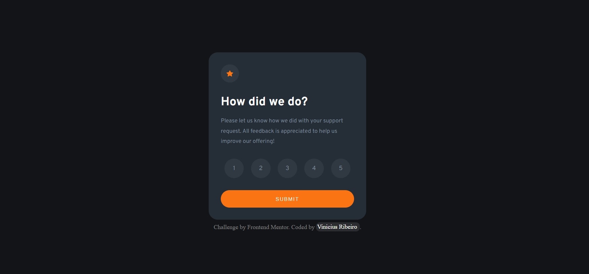
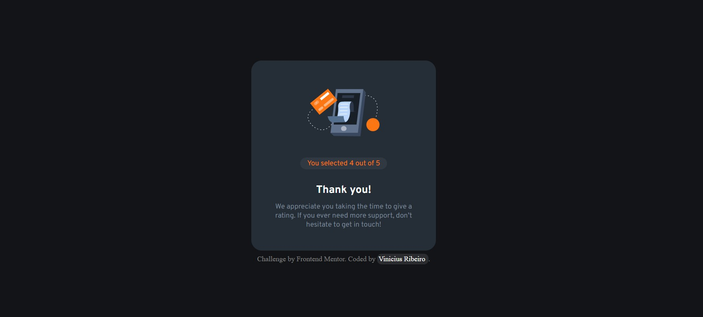
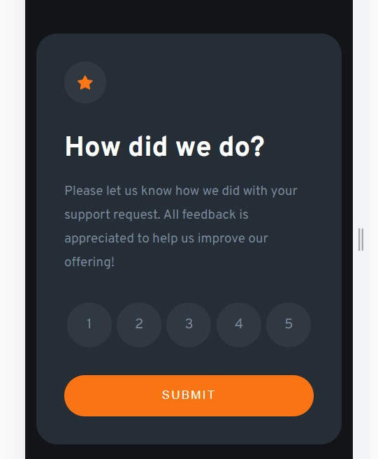

# Frontend Mentor - Product preview card component solution

This is a solution to the [Interactive rating component challenge on Frontend Mentor](https://www.frontendmentor.io/challenges/interactive-rating-component-koxpeBUmI). Frontend Mentor challenges help you improve your coding skills by building realistic projects. 

## Table of contents

  - [The challenge](#the-challenge)
  - [Screenshot](#screenshot)
  - [Links](#links)
  - [Built with](#built-with)
  - [What I learned](#what-i-learned)
- [Author](#author)

### The challenge

Users should be able to:

- View the optimal layout for the app depending on their device's screen size
- See hover states for all interactive elements on the page
- Select and submit a number rating
- See the "Thank you" card state after submitting a rating

### Screenshot

### Links

- Solution URL: [Add solution URL here](https://your-solution-url.com)
- Live Site URL: [Add live site URL here](https://your-live-site-url.com)

### Built with

- HTML5 
- CSS  properties
- Flexbox
- Grid Layout
- JavaScript

### What I learned

Very good project to practice HTML, CSS, JS, all interaction was done with JS. and it's working fine I think.

## Author

- Website - [TBD](https://www.your-site.com)
- Frontend Mentor - [@RibeiroPorto](https://www.frontendmentor.io/profile/RibeiroPorto)
- LinkedIn - [Vinicius Ribeiro](https://www.linkedin.com/in/vinicius-ribeiro-8676b9234/)

